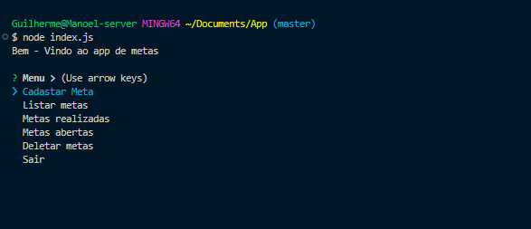

# ✅ Minha To-Do List

Bem-vindo(a) à minha To-Do List!  
Esse é um projetinho simples (mas útil!) feito para ajudar você a organizar suas tarefas do dia a dia.

Criei essa aplicação como forma de praticar e melhorar minhas habilidades com desenvolvimento web — e quem sabe ela também pode te ajudar a manter o foco 😄

## 📷 Prévia

## 📦 Tecnologias
- Javascript
- JSON
- Git e Github
- NodeJS

## 🚀 Funcionalidades
- [x] Cadastrar novas tarefas
- [x] Listar tarefas pendentes
- [x] Marcar tarefas como concluídas
- [x] Remover tarefas
- [x] Listar metas abertas ( Não realizadas)
- [x] Opção sair
- [x] Interface interativa por comandos no terminal

## 📬 Contato
- Email: guialmeida.dev@gmail.com
- LinkedIn: [linkedin.com/in/guilherme-almeida-2690782a6/](https://linkedin.com/in/guilherme-almeida-2690782a6/)
- GitHub: [github.com/GuilhermeAlmeida15](https://github.com/GuilhermeAlmeida15)

